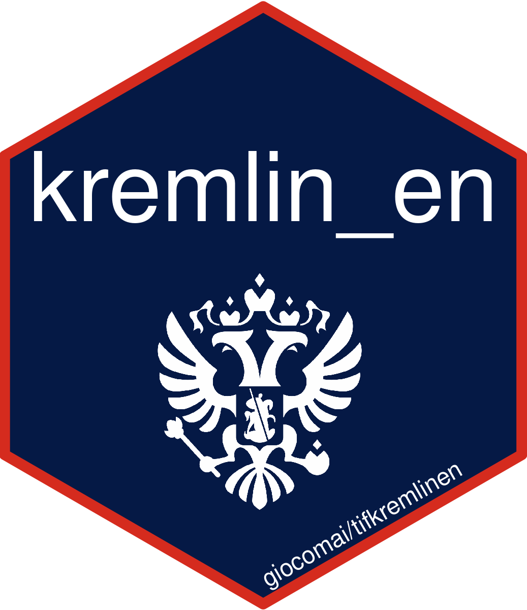

<!-- README.md is generated from README.Rmd. Please edit that file -->

```{r, include = FALSE}
knitr::opts_chunk$set(
  collapse = TRUE,
  comment = "#>",
  fig.path = "man/figures/README-",
  out.width = "100%"
)
library("dplyr", warn.conflicts = FALSE)
library("tifkremlinen")
```


# tifkremlinen <a href='https://github.com/giocomai/tifkremlinen'></a>

<!-- badges: start -->
<!-- badges: end -->

`tifkremlinen` is a package providing a single dataset - `kremlin_en` - including all contents published on the English-language version of [kremlin.ru](http://en.kremlin.ru/) starting with 31 December 1999 and until 31 December 2020. Yearly updates will likely be made available.

The website [kremlin.ru](http://en.kremlin.ru/) is the official website of the president of the Russian Federation. The most prominent part of the website is composed of news items reporting on the president's activities, speeches, and interviews.

## Installation

You can install this package from GitHub:

``` r
remotes::install_github("giocomai/tifkremlinen")
```

After installation, the dataset will be available as `tifkremlinen::kremlin_en`

## Structure of the dataset

The dataset is constructed in line with the [Text Interchange Format](https://docs.ropensci.org/tif/) (TIF) for increased compatibility with different software, and is made available in two tabular formats, as *corpus* and as *tokens*.  

### Corpus

This is the standard definition of *corpus* provided by the [TIF initiative](https://docs.ropensci.org/tif/):
> corpus (data frame) - A valid corpus data frame object is a data frame with at least two columns. The first column is called doc_id and is a character vector with UTF-8 encoding. Document ids must be unique. The second column is called text and must also be a character vector in UTF-8 encoding. Each individual document is represented by a single row in the data frame. Addition document-level metadata columns and corpus level attributes are allowed but not required.

This is a detailed version of all columns in the corpus dataset:

- `doc_id`: the id is a composed string, that should make the identifier unique even when used together with other similarly shaped datasets. Elements are separated by a an [hyphen-minus](https://en.wikipedia.org/wiki/Hyphen-minus). A an example `doc_id` would be `president_ru-en-012345`. Here is a detailed explanation of its components:
  - "president_ru": president of Russia ("ru" based on the [ISO 3166-1 alpha-2](https://en.wikipedia.org/wiki/List_of_ISO_3166_country_codes) standard for two-letters country codes)
  - "en" or "ru": language of the source website as a two letter code, following the [ISO 639-1 standard](https://en.wikipedia.org/wiki/List_of_ISO_639-1_codes))
  - a numeric id of 6 digits: a unique numeric id. For ease of reference, it is based on the series of digits that is found at the end of each relevant URL, e.g. `064750` for the document found at: http://en.special.kremlin.ru/events/president/news/64750. To enable consistent ordering, the id is *always* composed of 6 digits; for example, if the final digits of the link are 64, the numeric id would be "000064". 
- `text`: this includes the full text of the document, *including* the title and the textual string with date and location (when present). 
- `date`: date of publication in the year-month-date format (YYYY-MM-DD), in line with the [ISO 8601 standard](https://en.wikipedia.org/wiki/ISO_8601).
- `title`: the title of the document
- `location`: the location from where the document was issued as reported at the beginning of each post, e.g. "Novo-Ogaryovo, Moscow Region"; if not given, an empty string.
- `link`: a URL, source of the document
- `id`: numeric id; includes only the numeric part of `doc_id`, may be useful if only a numeric identifier is needed.
- `term`: a character string referring to the presidential term. The period after Yeltin's resignation, but before Putin's first inauguration in May 2000 is indicated as "Putin 0", the following as "Putin 1", "Putin 2", "Medvedev 1", "Putin 3", and "Putin 4"


## Summary statistics

- Date of earliest content included: `r kremlin_en %>% pull(date) %>% min()`
- Date of most recent content included: `r kremlin_en %>% pull(date) %>% max()`
- Number of documents: `r kremlin_en %>% nrow() %>% scales::number()`
- Number of words (tokens): `r kremlin_en %>% tidytext::unnest_tokens(output = word, input = text, token = "words") %>% nrow() %>% scales::number()`
- Columns included in the dataset: `r names(kremlin_en) %>% stringr::str_c(collapse = ", ")`

# Estimated updates

This dataset is expected to be updated on a yearly basis.

# Licensing

As of this writing in April 2021, the footer of the Kremlin's website includes the following notice:

> All content on this site is licensed under [Creative Commons Attribution 4.0 International](http://creativecommons.org/licenses/by/4.0/deed.en)

This license gives the right to "copy and redistribute the material in any medium or format", and to "remix, transform, and build upon the material for any purpose, even commercially", as long as appropriate credit is given to the source and the license is included.

This dataset - "Kremlin dataset for content analysis" - and related tools have been created within the remits of this license. The dataset itself is also distributed by its creator, [Giorgio Comai](https://giorgiocomai.eu/), with the same [CC-BY]((http://creativecommons.org/licenses/by/4.0/deed.en)) license, as well as under the [Open Data Commons Attribution license (ODC-BY)](https://opendatacommons.org/licenses/by/1-0/index.html). 
